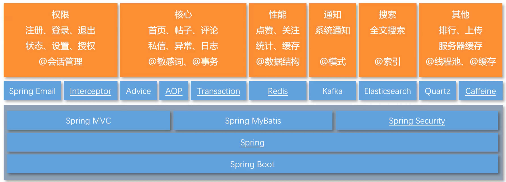

# 基于springboot2.x的在线论坛

1. 构建版本

|     工具      |    版本    |
| :-----------: | :--------: |
|     Maven     |   3.9.5    |
|      Jdk      |     8      |
| Elasticsearch |   6.4.3    |
|     Mysql     |    5.7     |
|     Kafka     | 2.12-2.3.0 |
|     Redis     |   7.0.2    |
|     Nginx     |   1.20.1   |
|    Tomcat     |   9.0.82   |

2. 核心功能
   - 发帖、评论、私信、转发；
   - 点赞、关注、通知、搜索；
   - 权限、统计、调度、监控；
3. 核心技术
   -  Spring Boot、SSM
   -  Redis、Kafka、ElasticSearch
   -  Spring Security、Quatz、Caffeine
4. 项目亮点
   - 项目构建在Spring Boot+SSM框架之上，并统一的进行了状态管理、事务管理、异常处理；
   - 利用Redis实现了点赞和关注功能，单机可达3000TPS；
   - 利用Kafka实现了异步的站内通知，单机可达5000TPS；
   - 利用ElasticSearch实现了全文搜索功能，可准确匹配搜索结果，并高亮显示关键词；
   - 利用Caffeine+Redis实现了两级缓存，并优化了热门帖子的访问，单机可达4000QPS。
   - 利用Spring Security实现了权限控制，实现了多重角色、URL级别的权限管理；
   - 利用HyperLogLog、Bitmap分别实现了UV、DAU的统计功能，100万用户数据只需几M内存空间；
   -  利用Quartz实现了任务调度功能，并实现了定时计算帖子分数、定时清理垃圾文件等功能；
   - 利用Actuator对应用的Bean、缓存、日志、路径等多个维度进行了监控，并通过自定义的端点对数据库连接进行了监控。

5. 主要模块

6. 特殊账户（账号密码相同）
   - `root` : 权限：删除帖子，可以访问后台页面`/data`展示UV（用户访问量）
   - `moderator` : 权限 ： 帖子置顶与帖子加精操作

